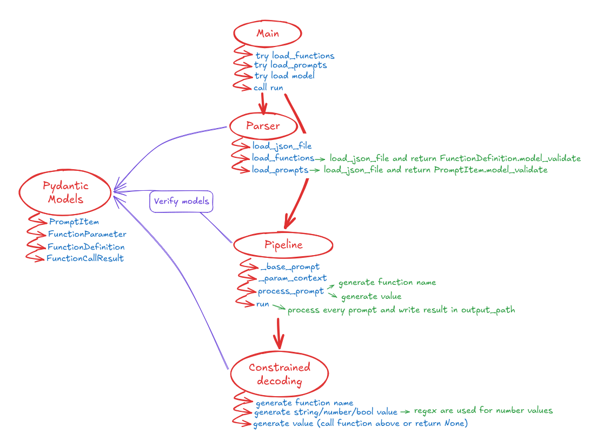

*This project has been created as part of the 42 curriculum by gmach.*

# Call Me Maybe

## Description

This project implements a **function calling** system for small language models. In our case we are using a small LLM called 'Qwen' (Qwen3-0.6B).
We are given a prompt (with possible multiple entries) and a set of function definitions (name, parameters, return type, description). The goal is to extract the most appropriate function name and the argument values from the prompt and output them in a JSON file.

The goal of this project is to implement a **constrained decoding logic** that ensures the output is always valid according to the function definitions and the expected JSON schema.

### Qwen3-0.6B Characteristics

| Characteristic | Details |
|---|---|
| Parameters | 600M |
| Layers | 28 |
| Context window | up to 32,768 tokens |
| Multilingual support | 100+ languages, with strong instruction-following and translation capabilities |
| Modes | Thinking mode (complex logic, math, code) and Non-thinking mode (fast, general-purpose chat) |

It's still a small-scale model, so it is definitely not as powerful as larger models, and not as good at reasoning and understanding complex instructions. However, it is still a very capable model that can be used for a variety of tasks and is a good choice for this project to demonstrate the constrained decoding logic.

### Schema of Call Me Maybe logic

Here's a little schema of the logic of the project:



## Instructions

To install the required dependencies, run:

```bash
make install
```
To run the program with the default input and output paths, simply execute:

```bash
make run
```

### Other Makefile targets

| Target | Effect |
|---|---|
| `make debug` | run under `pdb` |
| `make lint` | flake8 + mypy |
| `make lint-strict` | flake8 + mypy --strict |
| `make clean` | remove caches |

If you wish to change the input, feel free to modify the paths in `Makefile` or pass them as command-line arguments:

```bash
uv run python -m src \
  --functions_definition data/input/functions_definition.json \
  --input               data/input/function_calling_tests.json \
  --output              data/output/my_results.json
```

## Algorithm explanation

### Function name selection

Every function name is **pre-tokenized once** with `model.encode()` which is a method from the LLM that converts the function name into a sequence of token IDs. We store these function name token sequences in a dictionary for quick access.

At each generation step the decoder maintains a set of *active* candidates
(functions whose token sequence matches the tokens generated so far). At each step the top-K logits (K = 100) are inspected and only tokens that match the next token in any of the active candidates are allowed.  If a token is generated that does not match any active candidate, the decoding stops and the function with the longest matching prefix is selected.

### Parameter value generation

After the function is chosen, the values are generated one parameter at a time.
For each parameter the pipeline builds a full context string:

```
...Function: fn_add_numbers
Parameters: {"a":
```

The LLM is asked to continue from that exact position.  Depending on the
declared JSON type, a different constrained generator is used. 4 types are supported: **number** (and a specific one for **integer**), **string**, **boolean**.

* **number** - at each step the top-100 logits are inspected; only tokens
  whose decoded string consists entirely of number characters (`[-0-9.eE+]`)
  and whose concatenation with the accumulated value is still a valid number
  prefix are allowed.  Generation stops when the model's greedy choice is no
  longer a number character (and at least one digit has been produced).

* **string** - tokens are generated one after another and till we find the closing double-quote.
  Special character such as `\"`, `\\`, `\n`, `\t`, etc. are allowed and are handled by the decoder.  Once the closing quote is found, the collected buffer is run through
  `json.loads` so escape sequences (`\"`, `\\`, `\n`, `\t`, ...) resolve to
  their real characters.

* **boolean** - the top-100 tokens are scanned; the highest-logit token that
  decodes to exactly `"true"` or `"false"` determines the result.

All three generators use a **decode cache** (`dict[int, str]`): each token
ID is decoded at most once per run, avoiding repeated calls to `model.decode`.

## Design decisions

* **No vocab file** - the `get_path_to_vocab_file()` helper is not used.
  Token strings are obtained on demand via `model.decode([token_id])` and
  memoised in a shared dictionary.  This keeps the implementation simple and
  independent of the file format.

* **Prompt format** - for the prompt we use a simple format that is easy to parse and read. The function name is always on a line by itself, followed by the parameters in JSON format.  This makes it easy to extract the function name and parameters from the prompt.

* **Parameter context reuse** - previously generated parameter values are
  injected back into the context for each subsequent parameter, giving the
  model full visibility of what has already been filled in.

* **Token cache** - a single `dict[int, str]` is shared across all decoding steps and parameter generations.  Each token ID is decoded at most once per run.

* **Ignore invalid inputs** - a choice was made to ignore invalid inputs and continue the decoding process. If an invalid input is encountered, a message will be printed and the decoder will continue to the next entry. The JSON in input must still be valid, otherwise the program will raise an error and stop.

## Performance analysis

* **Accuracy** - since we're basically building the JSON output step by step, the decoder can only produce valid JSON that matches the schema.  The model is never allowed to generate arbitrary text, so the output is guaranteed to be JSON valid. Although some inaccuracies may occur especially for regex patterns and if the prompt is looking for an unknown function name. The decoder will try to find the closest match but it may not be the correct one.

* **Speed** - thanks to the memoization of decoded tokens and the caching of intermediate results, the decoding process is relatively fast.  The most time-consuming part is the actual model inference, which is dependent on the model size and the hardware used.

## Challenges faced

* **Subject/LLM comprehension** - I had a hard time understanding how the subject (and the LLM) works and the logit filtering process. I didn't really understand at first that the model had to generate the output step by step. I thought we had to generate the whole output at once and then filter the logits. This was a big misunderstanding that made me waste a lot of time at the beginning of the project.

* **Special character handling** - special characters such as `\n`, `\t`, `\"`, and `\\` are handled by the decoder.  The decoder keeps track of whether the last character was a backslash and whether we are inside a string.  This allows us to correctly handle escape sequences and ensure that the generated string is valid JSON.

* **Performance issues** - at the beginning of the project, I was working on a poorly performing machine and I had to find solutions to improve the performance. Thus the utilisation of caching and memoization.

* **TypeVar for Pydantic models** - I had to create a TypeVar in the parser to handle different type of BaseModel according to the pydantic models I created. Otherwise, mypy would raise type errors. Another solution to this problem would have to simply use a function for each BaseModel but the solution seems less elegant and harder to maintain.

* **Prompt engineering** - I messed a bit with the prompt but a simple straight to the point preprompt worked better.

* **Regex patterns** - some regex patterns have been used to match and extract specific parts of the input data. This was especially useful for the number generation where we had to match a sequence of tokens that together form a valid number.

## Testing strategy

There is no automated test suite (not required for the mandatory part).
Most of the testing was done manually by running the program with different prompts and checking the output.

Beyond the provided 11 prompts, the following edge cases were checked
manually:

* empty / missing input files, and malformed JSON in either input file
  (must fail with a clear message, not a traceback)
* prompts containing embedded double quotes (e.g. `Replace all numbers in
  "Hello 34 I'm 233 years old" with NUMBERS`)
* string values that must themselves contain a literal `"` or `\` character
  once generated - `generate_string_value` scans for an *unescaped* closing
  quote and JSON-unescapes the collected buffer, so `\"`, `\\`, `\n`, `\t`
  inside a value round-trip correctly instead of truncating the string early
* multi-parameter functions where an earlier string parameter is echoed back
  into the context for later parameters (`_param_context` now builds that
  context with `json.dumps`, so control characters are escaped correctly)
* a value typed `"integer"` where the model's constrained number output is
  not a whole number (rounded instead of discarded)

```bash
make run           # full end-to-end run, then inspect the output file
```

## Example usage

```bash
# Default paths
uv run python -m src

# Custom paths
uv run python -m src \
  --functions_definition data/input/functions_definition.json \
  --input               data/input/function_calling_tests.json \
  --output              data/output/my_results.json
```

Example output entry:

```json
{
  "prompt": "What is the sum of 2 and 3?",
  "name": "fn_add_numbers",
  "parameters": {"a": 2.0, "b": 3.0}
}
```

## Resources

* Qwen3 model - https://huggingface.co/Qwen/Qwen3-0.6B
* Pydantic v2 - https://docs.pydantic.dev/latest/
* BPE tokenization - https://huggingface.co/learn/nlp-course/chapter6/5
* Constrained decoding overview - https://arxiv.org/abs/2407.09809
* JSON schema spec - https://json-schema.org/

**AI usage** - GitHub Copilot was used to help design and implement the
constrained decoding logic. It has been especially helpful to comprehend and implement correctly the token cache logic and memoization. It was also used to help write and format this README.md file.
