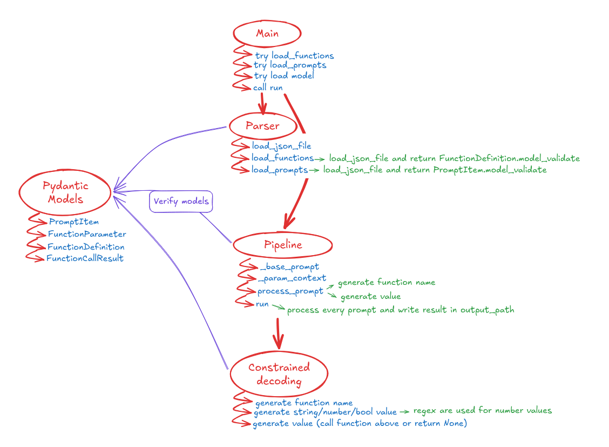

*This project has been created as part of the 42 curriculum by gmach.*

# Call Me Maybe

## Description

This project implements **function calling** for a small LLM (Qwen3-0.6B): given natural-language prompts and a set of function definitions (name, parameters, return type, description), it extracts the right function name and argument values and writes them to a JSON file. The core challenge is **constrained decoding** - guiding token-by-token generation so the output is always valid JSON matching the expected schema, without relying on the model to "just get it right".

### Qwen3-0.6B Characteristics

| Characteristic | Details |
|---|---|
| Parameters | 600M |
| Layers | 28 |
| Context window | up to 32,768 tokens |
| Multilingual support | 100+ languages |
| Modes | Thinking (complex logic, math, code) and Non-thinking (fast, general-purpose) |

A small model, less reliable at reasoning than larger ones - which is exactly what makes it a good testbed for constrained decoding.

### Schema



## Instructions

```bash
make install   # install dependencies
make run       # run with default input/output paths
```

| Target | Effect |
|---|---|
| `make debug` | run under `pdb` |
| `make lint` | flake8 + mypy |
| `make lint-strict` | flake8 + mypy --strict |
| `make clean` | remove caches |

Custom paths:

```bash
uv run python -m src \
  --functions_definition data/input/functions_definition.json \
  --input               data/input/function_calling_tests.json \
  --output              data/output/my_results.json
```

## Algorithm explanation

### Function name selection

Every function name is pre-tokenized once with `model.encode()` and cached. The decoder keeps a set of *active* candidates (functions matching what's been generated so far); at each step it only allows tokens that continue at least one active candidate, picking the highest-logit one among them. Since the next token always comes from that valid set, at least one candidate always survives - the loop is guaranteed to end in an exact match. `generate_function_name` requires a non-empty function list and raises otherwise, instead of ever returning unmatched text.

### Parameter value generation

For each parameter, the pipeline builds a context string ending right where the value should start:

```
...Function: fn_add_numbers
Parameters: {"a":
```

A different constrained generator runs depending on the declared type:

* **number/integer** - only tokens made of number characters (`[-0-9.eE+]`) that keep the accumulated value a valid number prefix are allowed; stops on the first non-number greedy choice. Scientific notation (`e`/`E`) can overflow a `float` to `inf` in just a few characters (e.g. `9e400`) - this is checked explicitly and raises instead of leaking `Infinity` into the output JSON.
* **string** - generates until an unescaped closing quote is found, then JSON-unescapes the buffer. Raises if the quote is never found or the buffer isn't valid JSON once closed, instead of returning truncated/mangled text.
* **boolean** - picks whichever of `"true"`/`"false"` has the higher logit among the top-100 tokens. Unlike the others, this one doesn't raise if neither is found - it currently defaults to `True` (known limitation, kept as-is for now).

All generators share a `dict[int, str]` decode cache so each token ID is decoded at most once per run.

## Design decisions

* **No vocab file** - token strings come from `model.decode([token_id])`, memoised in a shared cache, rather than parsing `get_path_to_vocab_file()`.
* **Prompt format** - a simple, easy-to-parse layout: function name on its own line, then parameters as JSON.
* **Parameter context reuse** - already-generated parameters are injected back into the context for later ones, so the model sees what it already committed to.
* **Fatal vs. skippable input errors** - a bad `functions_definition.json` entry aborts the run (a malformed function could corrupt everything downstream); a bad prompt in `function_calling_tests.json` is skipped and logged instead. Malformed JSON in either file is always fatal.
* **Strict parameter types** - `FunctionParameter.type` is a `Literal` of the exact types `generate_value` supports, rejected by Pydantic at load time if unknown - instead of silently reaching the dispatcher and returning `None`.
* **Explicit failures over silent bad output** - the generators raise instead of returning a default-looking value (`0.0`, a truncated string, an unmatched name). `pipeline.run()` catches this once per prompt, logs it, and still writes a schema-valid placeholder (`name: ""`, `parameters: {}`) - the output always has exactly `prompt`/`name`/`parameters`, success or failure.
* **Clean error messages** - `parser._format_errors` reformats Pydantic's `ValidationError` into one indented line per error, dropping the repeated "Value error," prefix and the doc-link noise.

## Performance analysis

* **Accuracy** - the decoder can only ever emit valid, schema-compliant JSON; wrong answers are possible (e.g. ambiguous prompts, ambitious regex) but malformed output isn't.
* **Speed** - dominated by model inference; token/decode caching removes redundant work around it.
* **Safety caps** - `MAX_NUM_STEPS` (32), `MAX_STR_STEPS` (64), `TOP_K` (100) aren't benchmarked values, just guards against Qwen3-0.6B diverging or never terminating naturally during decoding.

## Challenges faced

* **Understanding the subject/LLM** - I initially thought the whole output had to be generated first and filtered after, not token-by-token. That misunderstanding cost a lot of early time.
* **Special character handling** - tracking backslash/escape state token-by-token was needed to correctly detect the real closing quote and keep escape sequences valid.
* **Performance on a slow machine** - pushed me toward caching and memoization early on.
* **TypeVar for Pydantic models** - needed in the parser to validate different `BaseModel` types without mypy errors; a per-model function would have worked too but felt less maintainable.
* **Prompt engineering** - a short, direct pre-prompt beat more elaborate ones.
* **Regex patterns** - used to detect when a sequence of tokens together forms a valid number.
* **Numeric overflow -> invalid JSON** - a huge/scientific-notation number can silently overflow `float()` to `inf`, which `json.dump` would render as the invalid token `Infinity` (RFC 8259 doesn't allow it). Fixed with an explicit `isinf`/`isnan` check, plus `allow_nan=False` as a last resort.

## Testing strategy

No automated test suite (not required for the mandatory part) - tested manually against the provided prompts plus these edge cases:

* empty/missing/malformed input files (must fail clearly, not crash)
* prompts with embedded double quotes
* string values containing literal `"`/`\` once generated
* multi-parameter functions where an earlier string parameter is echoed into later context
* an `"integer"` parameter whose constrained number output isn't a whole number
* an extremely large/scientific-notation number (output must never contain `Infinity`/`NaN`)
* an unsupported or misspelled parameter type in `functions_definition.json`

```bash
make run   # full end-to-end run, then inspect the output file
```

## Example usage

```bash
uv run python -m src   # default paths

uv run python -m src \
  --functions_definition data/input/functions_definition.json \
  --input               data/input/function_calling_tests.json \
  --output              data/output/my_results.json
```

```json
{
  "prompt": "What is the sum of 2 and 3?",
  "name": "fn_add_numbers",
  "parameters": {"a": 2.0, "b": 3.0}
}
```

A failed prompt still keeps exactly the same 3 keys instead of crashing or adding extra ones:

```json
{"prompt": "...", "name": "", "parameters": {}}
```

The reason is logged to stderr.

## Resources

* Qwen3 model - https://huggingface.co/Qwen/Qwen3-0.6B
* BPE tokenization - https://huggingface.co/learn/nlp-course/chapter6/5
* Constrained decoding overview - https://arxiv.org/abs/2407.09809
* Blog post on constrained decoding - https://www.aidancooper.co.uk/constrained-decoding/
* JSON schema spec - https://json-schema.org/

**AI usage** - GitHub Copilot was used to help design and implement the
constrained decoding logic. It has been especially helpful to comprehend and
implement correctly the token cache logic and memoization. It also has been
used to help write and format this README.md file.
